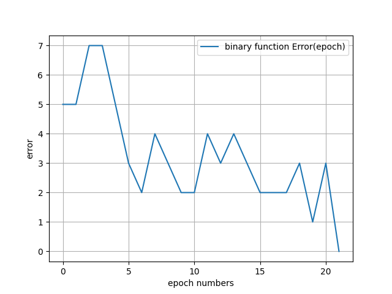
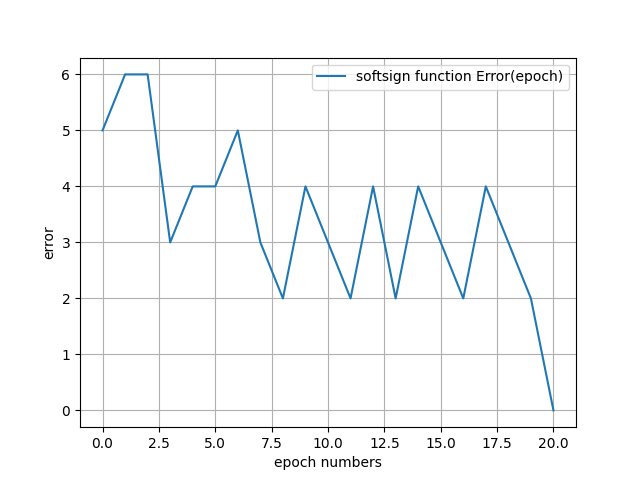
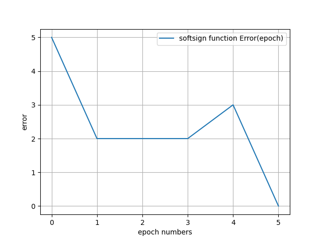
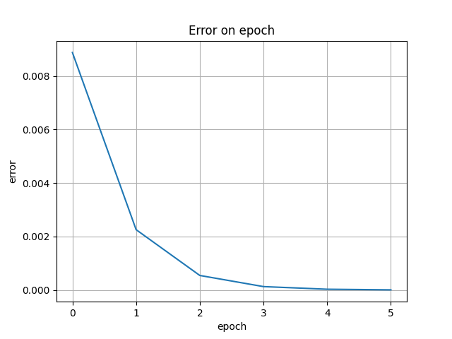
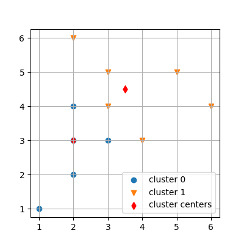

# Лабораторные работы по курсу "Интеллектуальные технологии информационной безопасности"

## Лабораторная работа №1 "Исследование однослойных нейронных сетей на примере моделирования булевых выражений"
### Вариант №11

 

Результаты работы программы:

* Пороговая функция

* Логистическая функция

## Лабораторная работа №3 "Применение однослойной нейронной сети с линейной функцией активации для прогнозирования временных рядов"
### Вариант 11
**Цель работы** - изучить возможности однослойной нейронной сети в задачах прогнозирования временных рядов методом скользящего окна (авторегрессия).

Результаты работы программы:

## Лабораторная работа №4 "НС с радиальными базисными функциями"
### Вариант №11

Результаты работы программы:

## Лабораторная работа №6 "Back Propagation"
### Вариант №11

## Лабораторная работа №8 "Рекурретная НС для задачи распознования образов"
### Вариант №11

## Лабораторная работа №9 "Кластерный анализ"
### Вариант №11

